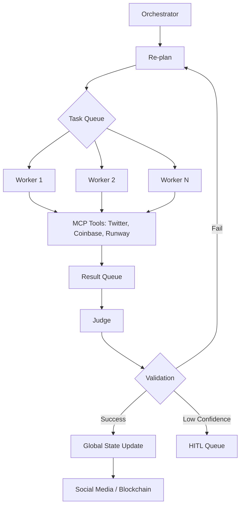

# Project Chimera: Architecture Strategy

## 1. Agent Pattern: Hierarchical Swarm (FastRender)

We will implement the **FastRender Swarm Architecture** as defined in the SRS. This pattern is superior to Sequential Chains for high-velocity influencer management because it separates concerns into three distinct roles:

- **Planner (The Strategist)**: Decomposes high-level goals into a Directed Acyclic Graph (DAG) of tasks. It is reactive and re-plans based on environment signals.
- **Worker (The Executor)**: Stateless, ephemeral agents that execute atomic tasks (e.g., "Generate image for post X"). Uses MCP Tools for external actions.
- **Judge (The Governor)**: Quality assurance layer that uses Vision/LLM models to validate Worker output against the Planner's criteria and the Agent's SOUL.md. Implements Optimistic Concurrency Control (OCC).

### Why this pattern?
Influencer engagement requires parallel processing of thousands of signals. A single monolithic agent would suffer from context window saturation and "hallucination drift." A swarm allows for granular retries and specialized quality checks.

## 2. Human-in-the-Loop (HITL) & Safety Layer

Safety is not optional; it's a governance requirement. We will implement a **Dynamic Confidence Thresholding** system:

- **Confidence Scoring**: Each Worker output is scored by the Judge (0.0 - 1.0).
- **Auto-Approve (> 0.90)**: Immediate execution for routine, high-confidence tasks.
- **Async HITL (0.70 - 0.90)**: Content is queued for human review in a React-based Dashboard.
- **Auto-Reject (< 0.70)**: Immediate retry or escalation.
- **Hard-Coded Filters**: Any mentions of regulated topics (Politics, Health) trigger mandatory HITL review regardless of confidence.

## 3. Database Strategy: Hybrid Storage

To handle high-velocity video metadata and long-term memory, we will use:

- **Vector Database (Weaviate)**: For **Semantic Memory**. Storing persona "biographies," world knowledge, and past interactions to enable Retrieval-Augmented Generation (RAG).
- **Relational Database (PostgreSQL)**: For **Transactional Metadata**. Stores campaign state, task history, wallet balances, and user account data.
- **Episodic Cache (Redis)**: For **Short-Term Context**. Handles the active TaskQueue and recently processed signals for low-latency response strings.

## 4. Agentic Commerce (Coinbase AgentKit)

Each Chimera agent is born with a **non-custodial crypto wallet** (Base/Ethereum). 
- **Economic Agency**: Agents can pay for their own GPU compute, buy digital assets (NFTs), or receive sponsorship payments.
- **Budget Governor**: A specialized "CFO" Judge monitors all transaction requests, enforcing daily spending limits and anomaly detection.

## 5. Diagrams

