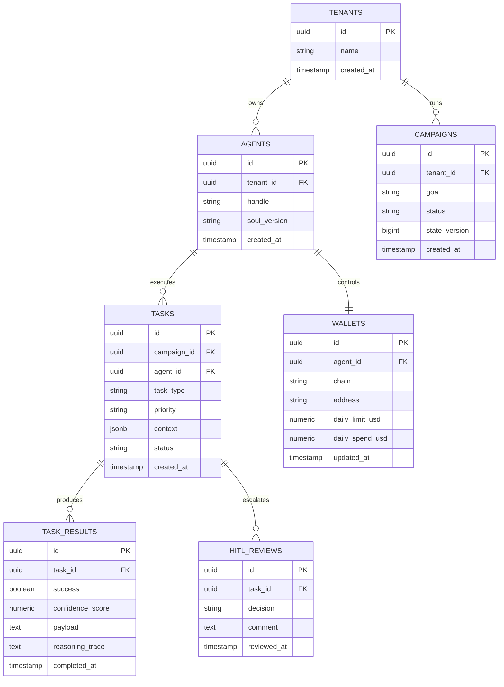

# Technical Specification

## 1. Core Architecture

- Pattern: FastRender-inspired `Planner -> Worker -> Judge`
- Queue model:
  - `task_queue`: planner to workers
  - `review_queue`: workers to judge
  - `dead_letter_queue`: exhausted tasks after max retries
- Queue runtime supports Redis-backed distributed queues with in-memory fallback.
- State consistency: optimistic concurrency control via `state_version`

## 2. API Contracts

## 2.1 Task Schema

```json
{
  "task_id": "uuid-v4-string",
  "task_type": "generate_content | reply_comment | execute_transaction",
  "priority": "high | medium | low",
  "context": {
    "goal_description": "string",
    "persona_constraints": ["string"],
    "required_resources": ["mcp://resource/path"]
  },
  "assigned_worker_id": "string",
  "created_at": "timestamp",
  "status": "pending | in_progress | review | complete"
}
```

## 2.2 Review Decision Schema

```json
{
  "task_id": "uuid",
  "outcome": "approved | rejected | escalated",
  "reason": "string",
  "next_status": "complete | rejected | escalated",
  "reviewed_at": "timestamp"
}
```

## 2.3 Skill I/O Contract Schema

```json
{
  "skill_name": "string",
  "agent_id": "string",
  "input": {"type": "object"},
  "projected_cost_usd": "number"
}
```

## 3. Data Model (ERD)



## 4. Concurrency and Reliability

- Worker execution uses `Executors.newVirtualThreadPerTaskExecutor()`.
- Judge applies OCC by validating `expected_state_version` against current snapshot.
- Rejected stale results are re-planned.
- Execution failures are retried up to `CHIMERA_QUEUE_MAX_RETRIES` before task IDs are routed to `dead_letter_queue`.
- Queue governance metrics track tenant retry/dead-letter counts for telemetry.
- Dead-letter replay is exposed through `POST /api/dead-letter/{taskId}/replay` and requeues task execution by resetting task status to `PENDING`.
- Replay governance enforces:
  - cooldown between accepted replays of the same task (`CHIMERA_REPLAY_COOLDOWN_SECONDS`)
  - max accepted replays per task per UTC day (`CHIMERA_REPLAY_MAX_PER_TASK_PER_DAY`)
- Replay decisions are audited in `api_dead_letter_replay_audit` (accepted/rejected + reason + timestamp).

## 4.1 MCP Perception and Social Action Slice

- `McpPerceptionService` polls MCP resources (`news://`, `twitter://`) and filters candidates using a semantic relevance threshold before emitting `TrendSignal` events.
- Runtime can resolve MCP resources through `HttpMcpResourceClient` (`CHIMERA_MCP_RESOURCE_ENDPOINT`) with deterministic static fallback for local resilience.
- `CreativeEngineService` orchestrates MCP creative tools (`creative.generate_text`, `creative.generate_image`, `creative.generate_video`) before publish/reply execution.
- Creative outputs pass through `creative.check_consistency`; failed/low-score outputs are consistency-locked before publish.
- `SocialPublishingService` enforces platform-agnostic social actions and resolves them to MCP tools (`twitter.post_tweet`, `instagram.publish_media`, `threads.publish_post`, and platform reply tools).
- `PlannerService` consumes perception signals during campaign decomposition, producing primary content tasks and trend-aware engagement tasks.
- `PlannerService` persists detected trend signals through `TrendSignalRepository` for telemetry and auditability.
- `WorkerService` executes publish/reply actions through `SocialPublishingService`, resolves platform routing from task resources, and applies bounded retry/backoff on MCP social actions.
- `TaskOrchestratorService` closes the loop by draining queued tasks, invoking worker execution, running `JudgeService` (including creative consistency checks), and persisting final status transitions (`IN_PROGRESS -> COMPLETE/ESCALATED/REJECTED`).
- `TelemetryApiService` exposes runtime queue depth, dead-letter depth, task status metrics, trend telemetry (`trendSignalsToday`, `topTrendTopicsToday`), queue resilience counters, and worker latency SLO metrics (`workerP50LatencyMs`, `workerP95LatencyMs`, execution success/failure totals).

## 4.2 Agentic Commerce Slice

- `CoinbaseAgentKitWalletProvider` implements wallet creation and USD transfer operations using `CDP_API_KEY_NAME` and `CDP_API_KEY_PRIVATE_KEY` secrets via `SecretProvider`.
- Coinbase requests are signed with HMAC-based headers (`X-CDP-SIGNATURE`, `X-CDP-TIMESTAMP`, `X-CDP-KEY-FINGERPRINT`) to avoid raw private-key transport.
- `WalletExecutionService` parses transaction contracts from task resources (`wallet://to/<address>`, `wallet://amount_usd/<decimal>`) and executes provider transfers.
- `WorkerService` routes `EXECUTE_TRANSACTION` tasks through wallet execution when configured.
- `TaskOrchestratorService` injects current daily spend from wallet ledger into `JudgeService` snapshot before approving transaction tasks.
- Approved transaction tasks are persisted into `api_wallet_ledger` through `WalletLedgerRepository`.
- Runtime fallback to `SimulatedWalletProvider` keeps local development deterministic when Coinbase credentials are not configured.

## 4.3 Cognitive Core Baseline

- Persona definition is stored in versioned `SOUL.md` markdown with YAML frontmatter.
- `AgentPersona` is loaded through `SoulMarkdownPersonaLoader`/`ClasspathSoulPersonaLoader`.
- `CognitiveContextAssembler` injects persona directives, voice traits, and recalled memory snippets into planner task context.
- Baseline memory retrieval uses `InMemoryMemoryRecall`; production path is planned for Redis + Weaviate semantic retrieval.

## 5. Security Controls

- Secrets loaded from environment variables only.
- Sensitive topic classifier enforces mandatory HITL routing.
- Budget governor denies spend above per-agent daily limits.
- Header-based authorization:
  - `X-Tenant-Id` + `X-Role`
  - plus one of `X-Api-Key` or `Authorization: Bearer <jwt>`
- API keys are bound to tenant identity and allowed runtime roles.
- JWT authentication validates signature (HS256 or RS256), claim expiry, tenant identity, and role claims.
- RS256 bearer tokens resolve `kid` against JWKS (remote URL or local file) with periodic reload for key rotation.
- Remote JWKS verification enforces timeout-bound fetch and fail-closed behavior on refresh/load errors.
- Optional issuer/audience claim checks enforce identity provider boundaries.
- Tenant-scoped persistence queries for task list and review updates.
- Write endpoints are rate-limited per tenant/path and return `429` on limit breach.
- Rate-limit backend precedence is `REDIS_URL` token bucket -> PostgreSQL `api_rate_limits` JDBC window -> local in-memory counters.
- Response/request correlation is enforced with `X-Request-Id` and audit logs.
